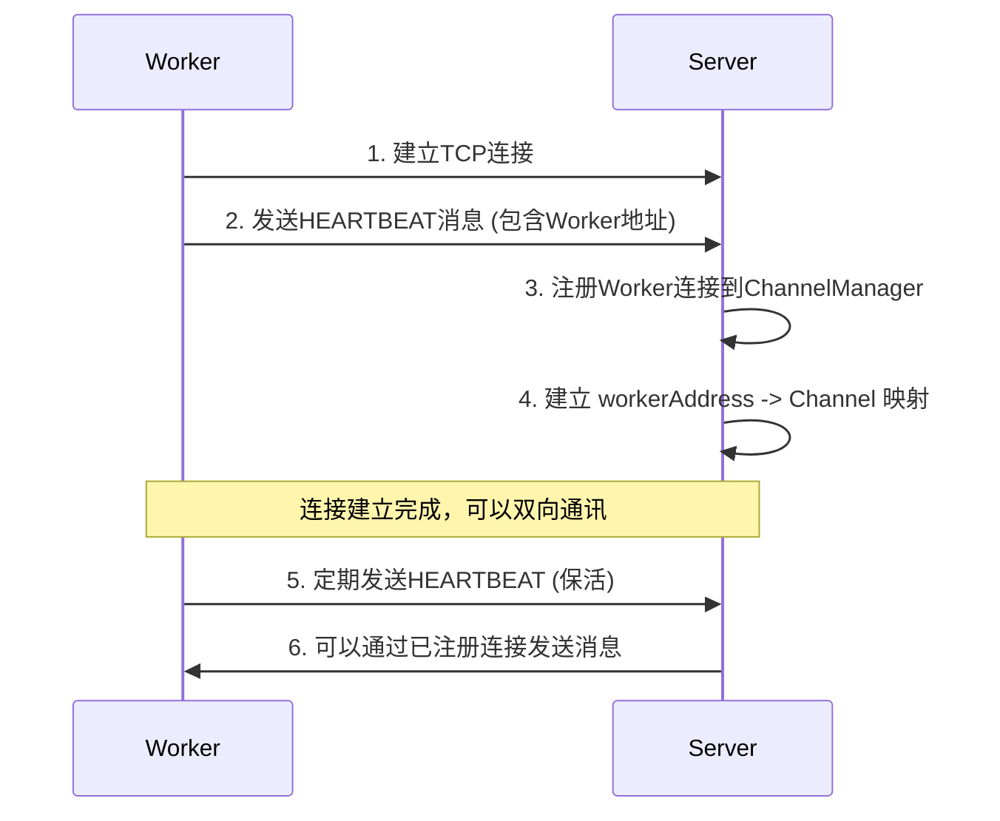
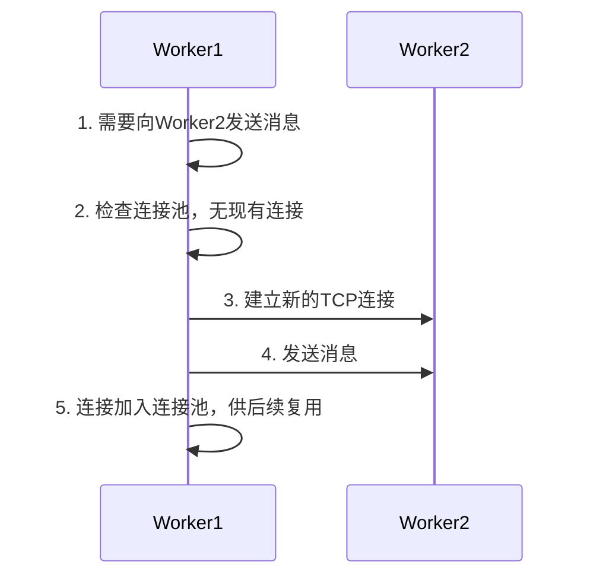

# PowerJob Mu 协议技术设计方案

## 1. 项目背景

### 1.1 业务场景
PowerJob 是一个分布式任务调度框架，采用 Server-Worker 架构。在实际部署中，经常遇到以下网络环境限制：
- Worker 节点部署在内网环境，只能单向访问公网的 Server
- Server 无法直接访问 Worker 的内网 IP 地址
- 业务需要支持 Server 向 Worker 的主动通讯（任务下发、状态查询等）

### 1.2 现有协议局限性
- **HTTP 协议**：基于请求-响应模式，Server 向 Worker 推送需要 Worker 轮询，实时性差
- **AKKA 协议**：功能强大但配置复杂，在 NAT 环境下需要复杂的网络配置

### 1.3 设计目标
1. 支持 Worker 仅可出站访问的网络环境
2. 实现 Server 与 Worker 的双向通讯
3. 支持完整的节点间通讯矩阵（Worker↔Server, Worker↔Worker, Server↔Server）
4. 保持高性能和低延迟
5. 简化网络配置和部署复杂度

## 2. 总体设计

### 2.1 核心设计原则

#### 连接复用 (Connection Reuse)
- Worker 主动建立到 Server 的长连接
- Server 通过注册机制维护 Worker 连接映射
- Server 复用 Worker 建立的连接进行反向通讯

#### 延迟连接 (Lazy Connection)
- 节点启动时不立即建立所有连接
- 首次通讯时才建立目标连接
- 避免启动时的网络依赖和连接失败

#### 统一架构 (Unified Architecture)
- 所有节点都具备 Server 和 Client 双重能力
- 统一的消息格式和处理流程
- 支持任意节点间的直接通讯

### 2.2 架构图

```
                    PowerJob Mu Protocol Architecture
    
    ┌──────────────────────────────────────────────────────────────────┐
    │                        Application Layer                         │
    ├──────────────────────────────────────────────────────────────────┤
    │  Actor System (Handler Registration & Message Routing)          │
    ├──────────────────────────────────────────────────────────────────┤
    │                      Transport Layer                             │
    │  ┌─────────────┐  ┌─────────────┐  ┌─────────────┐              │
    │  │MuTransporter│  │ChannelMgr   │  │ConnectionMgr│              │
    │  │             │  │             │  │             │              │
    │  │- tell()     │  │- Worker Reg │  │- Lazy Conn  │              │
    │  │- ask()      │  │- Ask/Resp   │  │- Conn Pool  │              │
    │  └─────────────┘  └─────────────┘  └─────────────┘              │
    ├──────────────────────────────────────────────────────────────────┤
    │                       Protocol Layer                             │
    │  ┌─────────────┐  ┌─────────────┐  ┌─────────────┐              │
    │  │ MuMessage   │  │MuMessageCodec│  │Message Types│              │
    │  │             │  │             │  │             │              │
    │  │- Type       │  │- Encode     │  │- TELL       │              │
    │  │- RequestId  │  │- Decode     │  │- ASK        │              │
    │  │- Path       │  │- Length     │  │- RESPONSE   │              │
    │  │- Payload    │  │- JSON       │  │- HEARTBEAT  │              │
    │  └─────────────┘  └─────────────┘  └─────────────┘              │
    ├──────────────────────────────────────────────────────────────────┤
    │                      Network Layer                               │
    │                      Netty Framework                             │
    │  ┌─────────────┐  ┌─────────────┐  ┌─────────────┐              │
    │  │EventLoopGroup│  │ Bootstrap   │  │ChannelPipe  │              │
    │  │             │  │             │  │             │              │
    │  │- Boss       │  │- Server     │  │- Codec      │              │
    │  │- Worker     │  │- Client     │  │- Handler    │              │
    │  └─────────────┘  └─────────────┘  └─────────────┘              │
    └──────────────────────────────────────────────────────────────────┘
```

## 3. 详细设计

### 3.1 通讯流程设计

#### 3.1.1 Worker 注册流程


#### 3.1.2 延迟连接流程


### 3.2 核心组件设计

#### 3.2.1 MuCSInitializer
```java
public class MuCSInitializer implements CSInitializer {
    
    // 根据节点类型初始化不同服务
    public void init(CSInitializerConfig config) {
        if (config.getServerType() == ServerType.SERVER) {
            initServer();  // 启动Netty服务端 + 连接管理器
        } else {
            initWorker();  // 启动Netty服务端 + 连接管理器
        }
    }
    
    private void initServer() {
        // 1. 创建ServerHandler
        // 2. 启动Netty服务端监听
        // 3. 初始化连接管理器
    }
    
    private void initWorker() {
        // 1. 创建WorkerHandler  
        // 2. 启动Netty服务端监听 (支持Worker间通讯)
        // 3. 初始化连接管理器
    }
}
```

#### 3.2.2 MuTransporter
```java
public class MuTransporter implements Transporter {
    
    public void tell(URL url, PowerSerializable request) {
        if (当前节点是Worker) {
            // 使用连接管理器建立到目标的连接
            connectionManager.getOrCreateConnection(url.getAddress())
                .thenAccept(channel -> channel.writeAndFlush(message));
        } else {
            // Server端需要区分目标类型
            if (目标是Worker) {
                // 使用已注册的Worker连接
                Channel channel = channelManager.getWorkerChannel(url.getAddress());
                channel.writeAndFlush(message);
            } else {
                // 使用连接管理器连接到目标Server
                connectionManager.getOrCreateConnection(url.getAddress())
                    .thenAccept(channel -> channel.writeAndFlush(message));
            }
        }
    }
    
    public <T> CompletionStage<T> ask(URL url, PowerSerializable request, Class<T> clz) {
        // 1. 生成唯一的requestId
        // 2. 注册Future到ChannelManager
        // 3. 按照tell的逻辑发送ASK消息
        // 4. 返回Future等待响应
    }
}
```

#### 3.2.3 ChannelManager
```java
public class ChannelManager {
    
    // Worker地址到连接的映射 (Server端用)
    private final ConcurrentMap<String, Channel> workerChannels;
    
    // 请求ID到Future的映射 (Ask模式用)
    private final ConcurrentMap<String, CompletableFuture<Object>> pendingRequests;
    
    // 请求ID到响应类型的映射 (类型转换用)
    private final ConcurrentMap<String, Class<?>> requestResponseTypes;
    
    public void registerWorkerChannel(Address workerAddress, Channel channel) {
        String key = workerAddress.getHost() + ":" + workerAddress.getPort();
        workerChannels.put(key, channel);
        // 监听连接关闭，自动清理映射
    }
    
    public void completePendingRequest(String requestId, Object response) {
        CompletableFuture<Object> future = pendingRequests.remove(requestId);
        Class<?> responseType = requestResponseTypes.remove(requestId);
        
        // 类型转换，解决LinkedHashMap问题
        Object convertedResponse = convertResponse(response, responseType);
        future.complete(convertedResponse);
    }
}
```

#### 3.2.4 MuConnectionManager
```java
public class MuConnectionManager {
    
    // 目标地址到连接的映射
    private final ConcurrentMap<String, Channel> connections;
    
    // 正在建立的连接
    private final ConcurrentMap<String, CompletableFuture<Channel>> pendingConnections;
    
    public CompletableFuture<Channel> getOrCreateConnection(Address targetAddress) {
        String key = targetAddress.getHost() + ":" + targetAddress.getPort();
        
        // 1. 检查现有连接
        Channel existingChannel = connections.get(key);
        if (existingChannel != null && existingChannel.isActive()) {
            return CompletableFuture.completedFuture(existingChannel);
        }
        
        // 2. 检查正在建立的连接
        CompletableFuture<Channel> pendingConnection = pendingConnections.get(key);
        if (pendingConnection != null) {
            return pendingConnection;
        }
        
        // 3. 建立新连接
        return createNewConnection(targetAddress);
    }
}
```

### 3.3 消息协议设计

#### 3.3.1 消息格式
```java
public class MuMessage implements PowerSerializable {
    private MessageType messageType;  // 消息类型
    private String requestId;         // 请求ID (Ask模式)
    private String path;              // 处理器路径
    private Address senderAddress;    // 发送方地址 (注册用)
    private Object payload;           // 消息载荷
    private String errorMessage;      // 错误信息
}

public enum MessageType {
    TELL,        // 单向消息
    ASK,         // 请求消息
    RESPONSE,    // 响应消息
    ERROR,       // 错误响应
    HEARTBEAT    // 心跳消息
}
```

#### 3.3.2 编解码器
```java
public class MuMessageCodec extends ByteToMessageCodec<MuMessage> {
    
    @Override
    protected void encode(ChannelHandlerContext ctx, MuMessage msg, ByteBuf out) {
        byte[] data = OBJECT_MAPPER.writeValueAsBytes(msg);
        out.writeInt(data.length);  // 长度前缀
        out.writeBytes(data);       // 消息内容
    }
    
    @Override
    protected void decode(ChannelHandlerContext ctx, ByteBuf in, List<Object> out) {
        if (in.readableBytes() < 4) return;  // 长度不足
        
        int length = in.readInt();
        if (in.readableBytes() < length) {
            in.resetReaderIndex();  // 重置读取位置
            return;
        }
        
        byte[] data = new byte[length];
        in.readBytes(data);
        MuMessage message = OBJECT_MAPPER.readValue(data, MuMessage.class);
        out.add(message);
    }
}
```

## 4. 关键技术方案

### 4.1 连接复用机制

#### 问题描述
在单向网络环境中，Server 无法主动连接到 Worker，但需要向 Worker 发送消息。

#### 解决方案
1. **Worker 主动注册**：Worker 启动时主动连接到 Server，并发送包含自身地址的心跳消息
2. **连接映射维护**：Server 维护 Worker 地址到连接通道的映射关系
3. **反向通讯**：Server 需要向 Worker 发送消息时，从映射中查找对应的连接通道

```java
// Worker端：发送心跳注册
MuMessage heartbeat = new MuMessage(
    MessageType.HEARTBEAT, null, null,
    workerAddress,  // 关键：携带Worker地址
    null, null
);
channel.writeAndFlush(heartbeat);

// Server端：处理心跳并注册
public void handleHeartbeat(ChannelHandlerContext ctx, MuMessage msg) {
    if (msg.getSenderAddress() != null) {
        channelManager.registerWorkerChannel(msg.getSenderAddress(), ctx.channel());
    }
}
```

### 4.2 延迟连接机制

#### 问题描述
节点启动时立即建立所有连接会导致：
- 启动时间长
- 网络故障影响启动
- 不必要的资源占用

#### 解决方案
1. **按需连接**：只在首次需要通讯时才建立连接
2. **连接缓存**：建立的连接保存在连接池中供后续复用
3. **并发控制**：避免同时建立到同一目标的多个连接

```java
public CompletableFuture<Channel> getOrCreateConnection(Address targetAddress) {
    // 1. 检查缓存连接
    Channel cached = connectionCache.get(addressKey);
    if (cached != null && cached.isActive()) {
        return CompletableFuture.completedFuture(cached);
    }
    
    // 2. 检查正在建立的连接，避免重复建立
    CompletableFuture<Channel> pending = pendingConnections.get(addressKey);
    if (pending != null) {
        return pending;
    }
    
    // 3. 建立新连接
    return createNewConnection(targetAddress);
}
```

### 4.3 消息路由机制

#### 问题描述
不同的通讯场景需要使用不同的连接方式，需要智能路由。

#### 解决方案
基于调用方类型和目标类型的二维路由表：

```java
public void routeMessage(URL url, MuMessage message) {
    if (currentNodeType == ServerType.WORKER) {
        // Worker作为发送方：统一使用连接管理器
        connectionManager.getOrCreateConnection(url.getAddress())
            .thenAccept(channel -> channel.writeAndFlush(message));
    } else {
        // Server作为发送方：根据目标类型选择策略
        if (url.getServerType() == ServerType.WORKER) {
            // 目标是Worker：使用已注册的连接
            Channel workerChannel = channelManager.getWorkerChannel(url.getAddress());
            workerChannel.writeAndFlush(message);
        } else {
            // 目标是Server：使用连接管理器
            connectionManager.getOrCreateConnection(url.getAddress())
                .thenAccept(channel -> channel.writeAndFlush(message));
        }
    }
}
```

### 4.4 类型转换机制

#### 问题描述
Jackson 反序列化时可能将对象反序列化为 LinkedHashMap，导致类型转换异常。

#### 解决方案
1. **类型映射**：Ask 请求时记录期望的响应类型
2. **智能转换**：响应时根据期望类型进行转换

```java
// 发送Ask请求时记录类型
public <T> CompletionStage<T> ask(URL url, PowerSerializable request, Class<T> clz) {
    String requestId = UUID.randomUUID().toString();
    channelManager.registerPendingRequest(requestId, future, clz);  // 记录期望类型
    // ... 发送消息
}

// 接收响应时转换类型
public void completePendingRequest(String requestId, Object response) {
    Class<?> expectedType = requestResponseTypes.remove(requestId);
    Object convertedResponse = JsonUtils.toJavaObject(response, expectedType);
    future.complete(convertedResponse);
}
```

## 5. 性能优化

### 5.1 连接池管理
- **连接复用**：相同目标的多次请求复用连接
- **连接清理**：自动检测和清理失效连接
- **连接限制**：控制最大连接数，避免资源耗尽

### 5.2 异步处理
- **非阻塞IO**：基于Netty的异步IO模型
- **事件驱动**：消息处理采用事件驱动方式
- **线程池优化**：合理配置EventLoopGroup大小

### 5.3 内存管理
- **零拷贝**：利用Netty的零拷贝特性
- **对象池**：复用消息对象，减少GC压力
- **缓冲区管理**：合理设置接收和发送缓冲区大小

## 6. 容错设计

### 6.1 连接故障处理
```java
// 连接断开监听
channel.closeFuture().addListener(future -> {
    // 清理连接映射
    connectionCache.remove(addressKey);
    workerChannels.remove(workerKey);
    
    // 失败所有待处理的请求
    failPendingRequests(channel);
});

// 自动重连
public CompletableFuture<Channel> reconnect(Address address) {
    return CompletableFuture
        .runAsync(() -> Thread.sleep(retryInterval))
        .thenCompose(v -> createConnection(address));
}
```

### 6.2 消息超时处理
```java
// Ask请求超时 (JDK8兼容方式)
ScheduledExecutorService scheduler = Executors.newSingleThreadScheduledExecutor();
scheduler.schedule(() -> {
    if (!future.isDone()) {
        channelManager.removePendingRequest(requestId);
        future.completeExceptionally(new TimeoutException("Request timeout"));
    }
}, timeout, TimeUnit.SECONDS);
```

### 6.3 异常传播
- **网络异常**：连接失败、超时等网络层异常
- **协议异常**：消息格式错误、编解码异常
- **业务异常**：处理器执行异常

## 7. 监控与运维

### 7.1 关键指标
- **连接数统计**：活跃连接数、总连接数
- **消息统计**：发送/接收消息数、消息大小
- **性能指标**：响应时间、吞吐量
- **错误统计**：连接失败、消息失败、超时次数

### 7.2 日志记录
```java
// 连接事件
log.info("[MuConnectionManager] Connected to {}", targetAddress);
log.warn("[MuConnectionManager] Connection failed to {}", targetAddress);

// 消息事件  
log.debug("[MuTransporter] Sent {} message to {}", messageType, url);
log.error("[MuHandler] Failed to process message", exception);
```

### 7.3 健康检查
- **连接健康**：定期检查连接状态
- **心跳监控**：监控Worker心跳状态
- **性能监控**：监控关键性能指标

## 8. 测试方案

### 8.1 单元测试
- **组件测试**：各核心组件的独立测试
- **协议测试**：消息编解码正确性测试
- **异常测试**：各种异常场景的处理测试

### 8.2 集成测试
- **通讯测试**：各种通讯场景的端到端测试
- **故障测试**：网络故障、节点故障的恢复测试
- **性能测试**：高并发、大数据量的性能测试

### 8.3 场景测试
```java
// Worker到Server通讯测试
@Test
public void testWorkerToServerCommunication() {
    // 1. 启动Server
    // 2. 启动Worker并连接到Server
    // 3. Worker发送消息到Server
    // 4. 验证Server收到消息
}

// 网络故障恢复测试
@Test  
public void testNetworkFailureRecovery() {
    // 1. 建立正常连接
    // 2. 模拟网络中断
    // 3. 恢复网络连接
    // 4. 验证通讯自动恢复
}
```

## 9. 部署指南

### 9.1 网络配置
```yaml
# Server配置
server:
  host: 0.0.0.0        # 监听所有网卡
  port: 7700           # 监听端口
  external_host: 公网IP # 外部访问地址

# Worker配置  
worker:
  host: 0.0.0.0        # 本地监听地址
  port: 27777          # 本地监听端口
  server_host: 公网IP   # Server地址
  server_port: 7700    # Server端口
```

### 9.2 防火墙配置
```bash
# Server端：开放监听端口
iptables -A INPUT -p tcp --dport 7700 -j ACCEPT

# Worker端：确保可以访问Server端口
# 通常不需要额外配置，确保出站不受限即可
```

### 9.3 高可用部署
- **Server集群**：多个Server实例负载均衡
- **Worker多连接**：Worker配置多个Server地址
- **故障转移**：自动检测和切换故障节点

## 10. 总结

PowerJob Mu 协议通过创新的连接复用和延迟连接机制，成功解决了单向网络环境下的双向通讯问题。主要技术特点包括：

1. **网络适应性**：专为受限网络环境设计，无需复杂的网络配置
2. **高性能**：基于Netty的异步IO，支持高并发和低延迟
3. **可靠性**：完善的故障检测和恢复机制
4. **扩展性**：统一的架构设计，支持多种通讯场景
5. **易部署**：简化的配置和部署流程

该协议特别适合云原生、容器化部署以及混合云环境，为PowerJob在复杂网络环境下提供了可靠的通讯基础。

---

*PowerJob Mu Protocol Technical Design*  
*Version: 1.0*  
*Date: January 2025*